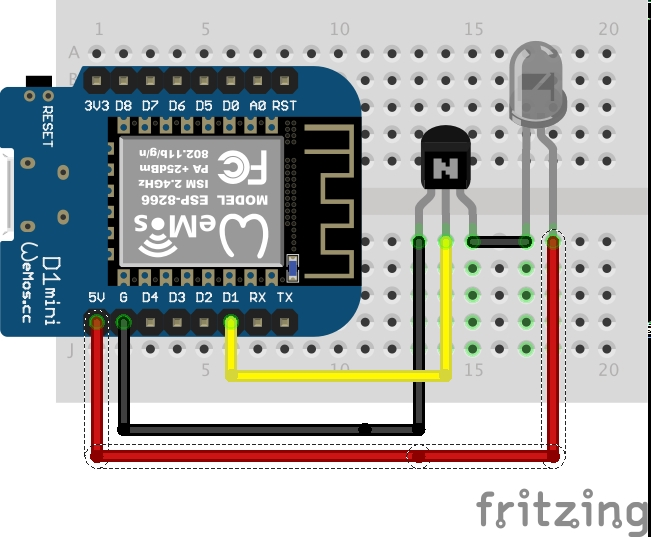
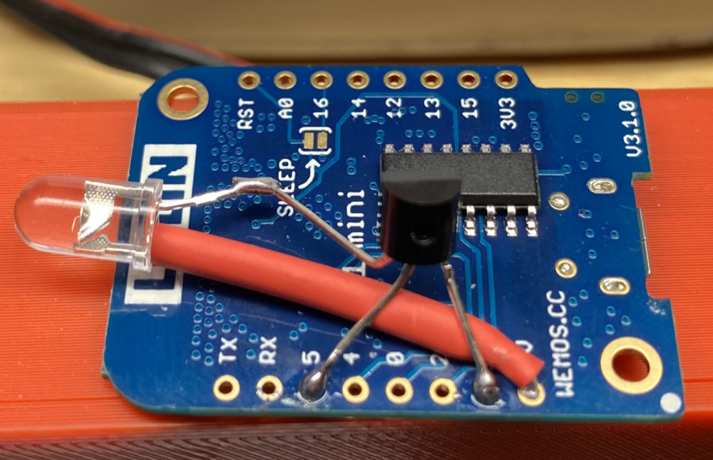
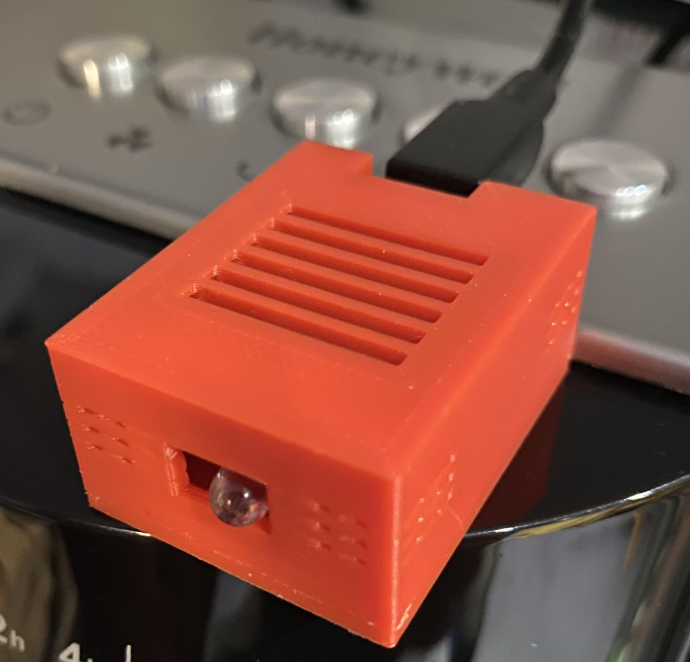

# Honeywell MQTT HO-5500RE IR Sender

A simple Arduino project to send IR signals to a Honeywell HO-5500RE Tower Fan using MQTT
  
   * [Library](#library)
   * [Hardware](#hardware)
   * [Circuit](#circuit)
   * [3D-Printed-Case](#3D-Printed-Case)

## Library 

This project uses the excellent [IRremoteESP](https://github.com/markszabo/IRremoteESP8266) library by markszabo, if you are interested in adapting this project to work with different devices or to learn how to read existing IR device codes please take a look at this library. 

## Hardware

* A ESP8266 board, for example a Wemos D1 Mini
* A IR LED
* A 2N2222 or similar transistor

The assumption is you are using an ESP8266 board, for example a Wemos D1 Mini.  The source code used D1 as the signal pin if you wish to change this please adjust kIrLed found in connections.h

A transistor is required to boost the power to the IR LED, without it you will struggle. 

## Circuit





## Configuration 

Rename `config.EXAMPLE.json` to `config.json` then fill in your wifi SSID and password and your MQTT details. I suggest you check that the name, device_id and base_topic are to your liking.

The device_id and base_topic will be used to make up the MQTT topic for the device and the device_id will also be used for the mDNS name. 

With the default settings you will have a mDNS name of honeywell-ir-sender.local and a MQTT topic of basement/fan/honeywell-ir-sender 

You need to upload the config.json file to SPIFFS 

```javascript
{
    "name": "Honeywell IR Sender",
    "device_id": "honeywell-ir-sender",
    "deep_sleep_interval": 600,
    "wifi": {
      "ssid": "WIFI_SSID",
      "password": "WIFI_PASSWORD"
    },
    "mqtt": {
      "host": "xxx.xxx.xxx.xxx",
      "port": 1883,
      "base_topic": "basement/fan/",
      "username": "MQTT_USERNAME",
      "password": "MQTT_PASSWORD"
    }
  }
```
## MQTT

There are five MQTT topics that you can publish to, you need to make sure you send something in the payload (it does not matter what) if you send a blank payload it will be ignored. It is written this way to allow me to have an auto off toggle switch that does not turn the fan off when I integrate this with Apple HomeKit. 

I will assume you have not changed the above device_id or base_topic, if you have please adjust as necessary.

Toggle Power
    "basement/fan/honeywell-ir-sender/pwr"

Toggle Fan Speed
    "basement/fan/honeywell-ir-sender/fan"

Toggle Oscillation
    "basement/fan/honeywell-ir-sender/osc" 

Toggle Timer
    "basement/fan/honeywell-ir-sender/tim"    

Toggle Wind Type
    "basement/fan/honeywell-ir-sender/win"   

## 3D-Printed-Case

There is a great modular case on Thingiverse for the Wemos D1 Mini, I have used and adapted it (it includes openSCAD files) for a few of my projects.  I recommend you take a look at [Wemos Mini Modular Case](https://www.thingiverse.com/thing:2225204) by orcusomega 

